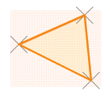
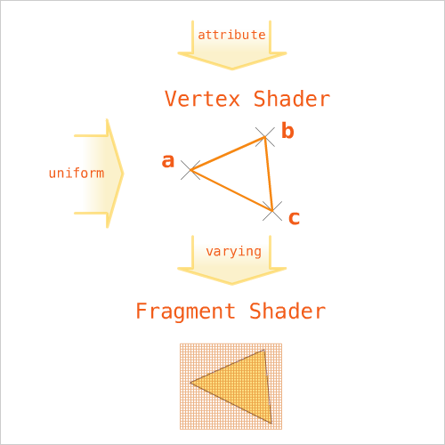

# Creating-WebGL: Triangles


To create complex 3D models within your browser a texture is applied over a mesh of triangles. The triangle is a basic structure for WebGL graphics ( and OpenGL graphics ).
This tutorial will only cover simple rendering of triangles the most basic use of shaders in a 2D context.  WebGL actually works in 3d but we will concentrate on triangles where all the corners have the same z value, and only transform the whole 2D shape in 3D.

##Shaders

WebGL works by running Shaders on your graphics card in parrallel, your graphics card is designed to be able to do lots of simple calculations all at the same time. The graphics card allows you to draw very complex scenes on the screen very fast by breaking the task into lots of tasks it can do all at the same time.  Shader are just simple c code uploaded to your GPU that can processes triangles into pixels, commonly a two step process. The two steps first to use a Vertex Shader, and then the second to apply a Pixel Shader.

### Vertex Shader - First Step

The first processing step is to pass triangles and other parameters to the Vertex Shader.  The vertex shader runs the calculations you ask of it 3 times for each corner of each triangle within the scene you want to render to the screen.

Typically we use the Vertex Shader to calculate the positions of the 3D triangles as a 4D vector ( vec4 ) eg: x, y, z, w. We will ignore "w" because it's not that relevant to what we are doing and beyond scope of this tutorial.

So we may define the position of each corner with one line of code, values for each axis are normally between -1 and 1.

```code
   gl_Position = modelViewProjection * vec4(pos, 1.0);
```

The Vertex shader helps us by calculating values to pass to the Fragment Shader.

### Fragment Shader - Second Step

The second step of processing is the Fragment Shader to take the 4D vector and map it to the 2D screen as pixels.  This is often where we process textures/colors of our triangle. This process runs once per pixel in the triangle so it's lucky it's done in parallel because otherwise it would take ages. This is also a 4D vector of Red, Green, Blue and Alpha ranging from 0 to 1, where 1 indicates saturation.

```code
    gl_FragColor = col;
```
## Visualizing the two step Shader process

This diagram shows the flow of data in the form of triangles, colors and transformations to the actual pixels we see on the screen.


```code
uniform mat4 modelViewProjection;
```

### Other Vertex and Fragment Shader inputs


## Deeper into the Shaders, the inputs we need to provide

In the diagram above we can see the general flow. In our Haxe javascript we pass the location of our triangles to the vertex shader and the 3D transforms to be applied, these are then passed from our vertex shader to our fragment shader, so that it can calculate the pixels to display. Lets look more closely at these inputs which are described at the top of each shader above the actual calculation section.

### Shader Inputs for the Vertex Shader ( First Step )
#### Attribute

At the top of our vertex shader c code we define the Attributes that get passed in. This normally includes the position.

```
attribute vec3 pos;
```

This indicates we are passing a 3 dimensional vector "vec3" called "pos", all attributes in webgl seem to be floats, either individual or as various vectors or matrices.

#### Uniform

Globally for all the triangle we can pass in parameters, such as a transform or a texture.  To control the position of all our triangles it's common to pass one 4x4 matrix to transform our triangles.
#### Const

We can also define constants in each of our shaders, like the Float pi.

```code
const float pi = 3.1415926;
```

#### Varying

Any attributes or calculations we want to pass between shaders, we do using the term 'varying'. For instance we might want to pass the color attributes for each corner from the vertex shader to the fragment shader. So in both shaders we have the same varrying defined.

```code
varying vec4 vcol;
```
## Defining Shaders in Strings
Webgl shaders are normally defined as a string and passed to webgl to be processed and uploaded to the GPU.

We can define our shaders as statics within our Haxe javascript code.
```haxe
    public static inline var vertexString: String =
        'attribute vec3 pos;' +
        'attribute vec4 color;' +
        'varying vec4 vcol;' +
        'uniform mat4 modelViewProjection;' +
        'void main(void) {' +
            ' gl_Position = modelViewProjection * vec4(pos, 1.0);' +
            ' vcol = color;' +
        '}';
    
    public static inline var fragmentString: String =
        'precision mediump float;'+
        'varying vec4 vcol;' +
        'void main(void) {' +
            ' gl_FragColor = vcol;' +
        '}';
```
In the the example we pass in the coordinates of the triangle and the color at each corner and a global transform matrix.  Then between shaders we pass the color.  You can see each shader is a bit like a function/class with any calculations in the void main.

```haxe
        'void main(void) {' +
            
        '}';
```
### Approach to Structuring a Webgl view
The approach to drawing our triangle can be broken down into two steps, the first is setup - setting up a webgl canvas and uploading the 'program' with 'shaders' to the GPU. Then the second step is every frame to pass the inputs such as the coordinates of our triangles to the 'program' for rendering.

#### Setup of WebGL , Shaders and Program.
1. Create a Canvas.
2. Get it's webgl 'context' to work with.
3. Convert the vertex string into a vertex shader.
4. Convert the fragment string into a fragment shader.
5. Create a program to upload to the GPU with the vertex and fragment shader.
6. Upload your attributes to the GPU, and set the indicies.
```haxe
    public function new(){
        gl = createWebGL( width, height );
        var vertex = createShaderFromString( gl, RenderingContext.VERTEX_SHADER, vertexString );
        var fragment = createShaderFromString( gl, RenderingContext.FRAGMENT_SHADER, fragmentString );
        program = createShaderProgram( gl, vertex, fragment );
        setTriangles( haxeLogoTriangles() );
        render();
    }
```
####  Render the triangles to the screen.

1. Clear the WebGL context, and draw background.
2. Set uniforms like the transform matrix ( and any textures ).
3. Draw triangles to screen.

```haxe
    function render(){
        // setup and clear
        gl.clearColor( 0.5, 0.5, 0.5, 0.9 );
        gl.enable( RenderingContext.DEPTH_TEST );
        gl.clear( RenderingContext.COLOR_BUFFER_BIT );
        gl.viewport( 0, 0, canvas.width, canvas.height );
        // apply transform matrices 
        var modelViewProjectionID = gl.getUniformLocation( program, 'modelViewProjection' );
        transferM4_arr32( matrix32Array, modelViewProjection );    
        gl.uniformMatrix4fv( modelViewProjectionID, false, matrix32Array );
        // draw
        gl.drawArrays( RenderingContext.TRIANGLES, 0, indices.length );
  ```
### Detail
Currently I have skipped over a lot of the detail as much of the connection between javascript and shaders is kind of wierd. This example is really just to get you started and should be supplemented with further reading and exploring the code yourself. But since there are very few simple Haxe examples around it should provide a starting point to further exploration.

## Haxe Specific Aspects to take note of when porting js examples.

Haxe Webgl is slightly different from normal JavaScript WebGL in one main way. 

In JavaScript many of the constants and global webgl functions are called directly from the WebGL instance, but in haxe you need instead to use the typed Rendering Context.
<http://api.haxe.org/js/html/webgl/RenderingContext.html>
.

So lines such as 
```haxe
gl.bufferData( RenderingContext.ARRAY_BUFFER, new Float32Array( arr ), RenderingContext.STATIC_DRAW );
```
look a bit different from many of the pure js webgl examples online, which would be more like:
```haxe
gl.bufferData( gl.ARRAY_BUFFER, new Float32Array( arr ), gl.STATIC_DRAW );
``` 
##A full demo of the concept in this tutorial
The haxe logo drawn with with triangles in WebGL.

### Haxe Logo in WebGL
[Haxe logo drawn with colored triangles in webgl](https://cdn.rawgit.com/nanjizal/CookingHaxe/master/01.Triangles-for-Vector-2D-graphics/index.html)

### Git link
<https://github.com/nanjizal/CookingHaxe/tree/master/01.Triangles-for-Vector-2D-graphics>
