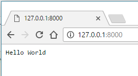

[tags]: / "javascript,nodejs,server"

# Create a server with Haxe/NodeJS

The following tutorial creates a http server using Haxe/Node.js at port 8000 and demonstrates how to build and run it.

> Haxe can compile to many targets, this example is specific for the Haxe/JavaScript target only.

## Installation

- Install [Node.js](https://nodejs.org/) on your machine.
- Install [hxnodejs](https://lib.haxe.org/p/hxnodejs) with `haxelib install hxnodejs` (released version).
- .. or install the latest version from github `haxelib git hxnodejs https://github.com/HaxeFoundation/hxnodejs`.

## Structure of this example

```
+ example/
  - Main.hx
  - build.hxml
  - run.hxml
```

## Main.hx

```haxe
class Main {
  static function main() {
    // Configure our HTTP server to respond with Hello World to all requests.
    var server = js.node.Http.createServer(function(request, response) {
      response.writeHead(200, {"Content-Type": "text/plain"});
      response.end("Hello World\n");
    });

    // Listen on port 8000, IP defaults to 127.0.0.1
    server.listen(8000);

    // Put a console.log on the terminal
    trace("Server running at 127.0.0.1:8000");
  }
}
```
> Note that each Haxe application has a static entrypoint which is called `main()`.

## Compile the Haxe/node.js server

Compile the example with `haxe -lib hxnodejs -main Main -js main.js`. You can also save this build configuration in a _build.hxml_ file:

```hxml
-lib hxnodejs 
-main Main 
-js main.js
```

To run the build.hxml script, it can be passed to the Haxe compiler on the commandline: `haxe build.hxml`. Windows users can double click the hxml file to run it.

## Run the Haxe/node.js server

To run the node application, use `node main.js`. Alternative, you can save this configuration in a _run.hxml_ file.
```hxml
-cmd node main.js
```

Then, load <http://127.0.0.1:8000/> in a browser to see the server output.



### Generated output

Haxe is an excellent JavaScript compiler, the output source is clean:

```js
(function () { "use strict";
var Main = function() { };
Main.main = function() {
  var server = js_node_Http.createServer(function(request,response) {
    response.writeHead(200,{ "Content-Type" : "text/plain"});
    response.end("Hello World\n");
  });
  server.listen(8000);
  console.log("Server running at 127.0.0.1:8000");
};
var js_node_Http = require("http");
Main.main();
})();
```

> **Related info:**  
>
> * [Haxe/Node.js API documentation](http://haxefoundation.github.io/hxnodejs/js/Node.html)
> * [Official Node.js documentation](http://nodejs.org/api/index.html)